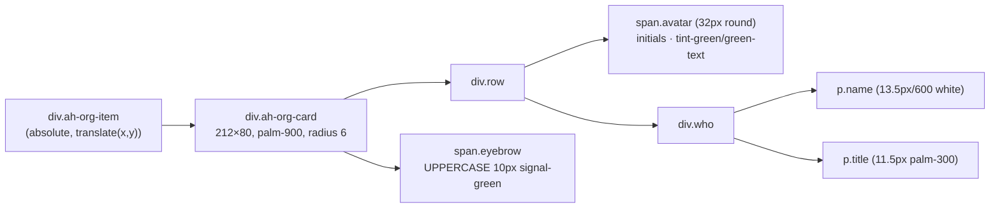

# Architecture & Data Flow — Ahlan Hamad Org Chart

## Data flow (capture → render)

```mermaid
flowchart TD
    subgraph Browser["Browser — React SPA (Vite)"]
        R["Org Chart route<br/>page-7lFh0q5H.js"]
        Q["useQuery(api.orgChart.getOrgTree)"]
        H["hr(): flat list → tree (by managerId)"]
        W["We(): tidy-tree layout<br/>k=212 K=80 je=24 sr=72 nt=64 de=48"]
        N["Node layer (role=tree, z-10)<br/>.ah-org-item · .ah-org-card"]
        C["Connector layer (z-0)<br/>1px .ah-org-seg elbows"]
        G[".ah-org-canvas grid + pan/zoom"]
    end

    subgraph Edge["Cloudflare edge"]
        CF["CDN / WAF"]
    end

    subgraph Convex["Convex backend (via Caddy)"]
        WS["WebSocket sync<br/>(query results)"]
        ACT["POST /api/action<br/>auth:signIn, mutations"]
        DB[("employees<br/>{_id, nameEn, jobTitleEn,<br/>department, managerId, status}")]
    end

    Q -->|subscribe| CF --> WS --> DB
    DB -->|flat employee[]| Q
    Q --> H --> W
    W --> N
    W --> C
    G --- N
    G --- C
    R -.hosts.-> Q
    ACT -->|RS256 JWT ~1h| Browser
    CF --- ACT
```

## Rendered node structure



## Layout math (one root)

`x = de + center − k/2 = 48 + 106 − 106 = 48`
`y = de + level·(K + nt) = 48 + 0 = 48`
`canvas = (maxX + k + de) × (maxY + K + de) = 308 × 176`

Confirmed against the live page: node at `translate(48px, 48px)`, bounds `308×176`. ✔
