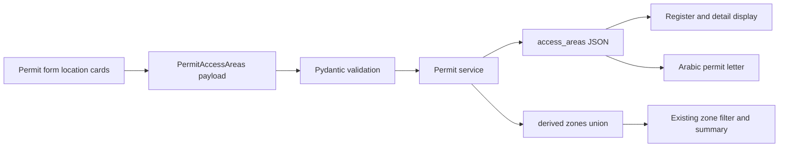

# Permit Location–Zone Pairing Design

**Date:** 2026-08-06  
**Status:** Approved mockup; implementation planning pending written-spec review

## Problem

A security permit currently stores only a flat list of zones: Green, Red, and Work residence. It cannot record whether Green or Red access applies to Al Wathba 1, Al Wathba 2, or both. The generated Arabic 1/5 permit letter repeats the same flat zone list, so a reader cannot distinguish, for example, “Al Wathba 1 — Green” from “Al Wathba 2 — Red.”

The permit must preserve exact location–zone pairings from creation through display, printing, and generated DOCX/PDF output.

## Approved Decisions

1. One permit may cover Al Wathba 1, Al Wathba 2, or both.
2. Green and Red are selected independently at each location.
3. Work residence remains a separate access option; it is not attached to either Al Wathba location.
4. Selecting a Green or Red zone automatically includes that location. There is no separate location checkbox.
5. A new permit starts with no access selected. The operator must make an explicit choice before issuing it.
6. The generated document lists only selected locations and only the zones selected at each location.
7. Existing permits are never assigned a location by guesswork.

## Scope

### Included

- New-permit and edit-permit access controls.
- Permit API and database persistence.
- Permit register rows, desktop detail, mobile surfaces, and detailed register print.
- Arabic 1/5 General Book DOCX/PDF generation.
- English and Arabic labels with RTL parity.
- Honest handling of permits created before location tracking.

### Not included

- User-defined or additional permit locations.
- A new register filter by location.
- Different access areas per person or vehicle within one permit.
- Changes to permit approval, renewal, revocation, or document attachment workflows.
- Retroactive regeneration of already-issued permit documents.

## User Experience

### New and Edit Permit Form

Replace the current flat zone checklist with one `Access areas` panel.

The panel contains two location cards:

- `Al Wathba 1 / الوثبة 1`
  - Green zone
  - Red zone
- `Al Wathba 2 / الوثبة 2`
  - Green zone
  - Red zone

Below the cards, show `Work residence / سكن العمل` as an independent option.

Desktop shows the two cards side by side. Mobile stacks them. Each zone is an `aria-pressed` button with a written label, color dot, and selected-state checkmark; color is never the only state signal. Logical alignment and spacing mirror under RTL.

The form is valid when at least one of these is true:

- Al Wathba 1 has Green or Red selected.
- Al Wathba 2 has Green or Red selected.
- Work residence is selected.

If nothing is selected, show the existing inline required-error pattern and disable `Issue permit` or `Save permit`.

### Display After Save

Replace ambiguous flat zone badges with compact access-area labels:

- `W1 · Green`
- `W1 · Red`
- `W2 · Green`
- `W2 · Red`
- `Work residence`

The full detail view uses complete localized location and zone names. The desktop register, mobile surface, and detailed register print use the compact forms where space is constrained.

### Legacy Permit Display and Edit

An existing permit with Green or Red zones has no trustworthy Al Wathba location. Its read response therefore has no structured access-area value.

Display its existing zone badges with `Location not specified / الموقع غير محدد`. When editing, show the previously recorded zones in an amber informational message and leave the Al Wathba cards unselected. Preserve an existing Work residence selection because it does not require an Al Wathba location. If the legacy permit contains Green or Red, `Save permit` remains disabled until the operator selects at least one exact Al Wathba location–zone pairing; Work residence alone does not satisfy that legacy edit.

Do not regenerate existing permit documents merely because the migration runs. If renewal or a roster amendment regenerates a legacy permit before its location is assigned, the new document preserves the old zones under an explicit `Location not specified` label. A later header edit that supplies location data follows the normal regeneration and approval behavior.

## Data Model

### Canonical Access Shape

Introduce one structured access object:

```json
{
  "al_wathba_1": ["green"],
  "al_wathba_2": ["red"],
  "work_residence": false
}
```

Rules:

- `al_wathba_1` and `al_wathba_2` contain only `green` and/or `red`.
- Values are de-duplicated and normalized to stable `green`, then `red` order.
- At least one location zone or `work_residence: true` is required for create and for access updates.
- Location order is always Al Wathba 1, then Al Wathba 2.

### Database

Add nullable JSON column `permits.access_areas`.

- New and newly edited permits store the canonical object.
- `NULL` means the permit predates location tracking; it does not mean “no access.”
- Keep the existing non-null `permits.zones` JSON list as a materialized union used by existing zone filters and summary counts.
- The service, not API callers, computes `zones` transactionally from `access_areas`:
  - Include `green` once if either location contains Green.
  - Include `red` once if either location contains Red.
  - Include `work_residence` once when enabled.

Keeping the union prevents inaccurate historical backfill and avoids replacing the established SQLite zone filter and summary queries. It is an intentional derived projection, not a second user-editable source of truth.

The migration is SQLite-safe and uses `batch_alter_table`. The new column stays nullable because populated legacy rows cannot be assigned a location safely.

### API

Add typed schemas equivalent to:

```python
PermitLocationZone = Literal["green", "red"]

class PermitAccessAreas(BaseModel):
    al_wathba_1: list[PermitLocationZone] = Field(default_factory=list)
    al_wathba_2: list[PermitLocationZone] = Field(default_factory=list)
    work_residence: bool = False
```

`PermitCreate` requires `access_areas`. `PermitUpdate` exposes it as an optional field to preserve partial-update semantics, while `PermitFormDialog` always submits it and applies the legacy validation above. Neither create nor update accepts a caller-supplied flat `zones` list after cutover.

Permit list and detail responses include:

- `access_areas: PermitAccessAreas | null`
- `zones`: the derived union, retained for the existing zone filter, summary, and explicit legacy display.

Regenerate `backend/openapi.json` and `frontend/src/lib/api.types.ts` through the project `sync-api-types` workflow after schema changes.

## Data Flow



The same structured access value drives on-screen labels, the detailed register print, and the generated permit letter. No document wording is reconstructed from unrelated location and zone lists.

## Generated Document Behavior

The current narrative directly inserts a flat Arabic zone phrase. Replace that clause with a reference to the explicit access block:

> الدخول من البوابة الرئيسية إلى المواقع والمناطق الموضحة أدناه

Rename the information row to:

> مواقع ومناطق الدخول المصرّح بها

Render one line per selected Al Wathba location:

```text
الوثبة 1 — المنطقة الخضراء
الوثبة 2 — المنطقة الحمراء
```

If one location has both zones, keep them grouped on one line:

```text
الوثبة 1 — المنطقة الخضراء والمنطقة الحمراء
```

If Work residence is selected, render it as a separate line that is not associated with either Al Wathba location:

```text
منطقة أخرى — سكن العمل
```

Only selected locations appear. This prevents a document with Al Wathba 1 Green and Al Wathba 2 Red from implying the opposite two pairings.

If a legacy permit must be regenerated while `access_areas` is still `NULL`, preserve its known flat zones without inventing a site:

```text
الموقع غير محدد — المنطقة الخضراء والمنطقة الحمراء
منطقة أخرى — سكن العمل
```

The first line includes only the legacy Green/Red values that exist. The second line appears only when Work residence exists.

The detailed permit register print uses the same formatter. Attached permit scans are external evidence and are not modified.

## Validation and Error Handling

- Reject an empty access object at the API boundary with HTTP 422.
- Reject any location zone other than Green or Red.
- De-duplicate repeated zone values and emit them in stable order.
- Escape every localized label or free-text value inserted into generated HTML.
- If `access_areas` is `NULL`, render the explicit legacy label rather than inventing a location.
- Preserve the current resilient document-generation behavior: a PDF conversion failure may leave the Book committed without a PDF, while the structured permit record remains saved.
- Approval resubmission after an edited permit continues through the existing regeneration workflow.

## Components and Reuse

- `PermitFormDialog`: owns the editable access-area state and validation.
- A small permit-specific access formatter/component replaces `ZoneBadge` where exact pairings must be shown.
- `PermitDetailDialog` and `PermitsPage` reuse that formatter for desktop, mobile, and print surfaces.
- `permit_service`: computes the flat zone union and supplies structured access to letter generation.
- `permit_letter`: formats exact Arabic location–zone lines.

Do not introduce a generic location framework, configuration table, or new dependency. The two fixed Al Wathba locations are the complete approved scope.

## Verification

### Backend

- Schema accepts each location individually, both locations, both zones at one location, and Work-residence-only access.
- Schema rejects an entirely empty selection and invalid location zones.
- Service stores `access_areas` and derives a de-duplicated `zones` union.
- Green selected at both locations contributes one Green entry and one person count to existing summaries.
- Existing zone filters continue to match the derived union.
- Migration upgrade preserves every legacy `zones` value and leaves `access_areas` null; downgrade removes only the new column.
- Letter tests cover:
  - one location and one zone;
  - one location and both zones;
  - both locations with different zones;
  - both locations with overlapping zones;
  - Work residence alone and alongside a location;
  - legacy location-unspecified output.

### Frontend

- Form interaction sends the exact structured payload.
- New form starts with no access selected and cannot submit empty access.
- Edit form hydrates structured access correctly.
- Legacy edit shows the location-unspecified warning and does not guess a site.
- Register, detail, mobile, and print surfaces render exact pairings.
- English and Arabic translation-key parity tests cover every new label.

### Required Reviews and Smoke Test

- Run the Alembic migration reviewer and confirm one migration head.
- Run the i18n/RTL reviewer after English and Arabic UI and document strings are final.
- Regenerate and validate frontend API types.
- Exercise the real new-permit flow in both English/LTR and Arabic/RTL:
  1. Select Al Wathba 1 Green and Al Wathba 2 Red.
  2. Issue the permit.
  3. Confirm the register and detail show those exact pairings.
  4. Open the generated DOCX/PDF and confirm it lists only those two pairings.
