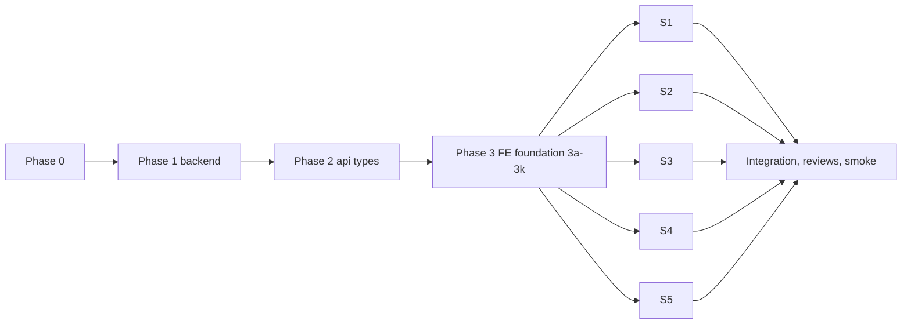

# Record page v2 — implementation plan (revised after review)

Audience: the build agent. Follow the phases in order; parallelise only where §4 says so.

Inputs:
- `layout.md`, `preview.md`, `clarity.md` (this folder);
- `mockups/record-page-v2-prototype.html` (target UX; copy it into the worktree, it is untracked);
- `AGENTS.md`, `DESIGN.md`, `PRODUCT.md`;
- the review files `review-layout.md`, `review-preview.md`, `review-clarity.md`. They are resolved in §9.

Paths:
- `fe/` = `frontend/src/`, `be/` = `backend/app/`.
- BRP = `fe/pages/books/BookRecordPage.tsx`, BP = `fe/pages/books/BooksPage.tsx`, RP = `fe/pages/books/RecordPane.tsx`, RPV = `fe/pages/books/RecordPaperViewer.tsx`.
- `proto:N` = a line in the prototype.

Citations:
- The three audits' citations were re-checked against HEAD `5fd8ffa6` (≈230 spot checks) with no material drift. The only stale ones were the locale lines, now `en.json:3405-3406` / `ar.json:3643-3644`.
- Every review correction was verified independently against the code before this revision (§9).

**Precedence rule.** Where `clarity.md` and the prototype disagree, the prototype wins, because it is the approved target. Example: the prototype's `nextStep` (proto:588-602) has no "Scan signed copy" secondary for draft or pending-not-me, although clarity P3 lists one.

---

## 1. Verdicts on the user's claims

### B. "Only general books carry the creator": PARTIAL (the creator exists, but the UI never shows it)

- **The creator is stored for every generated kind, but on the version.** `BookVersion.created_by_user_id` (`be/db/models.py:320`, nullable, no index) is set by the shared generation pipeline for every template:
  - initial `document_service.py:2126`, revision `:2075`, in-place draft edit `:2048`;
  - Word finish `word_book_service.py:498-505`.

  Lists and detail expose it only as `original_creator_user_id` (id only, `api/v1/books.py:638`). There is **no name**.
- **The UI shows the submitter, not the creator.** The header uses `book.submitted_by_name` ("Submitted by", BRP `:651`, `:1084-1093`).
  - `Book.submitted_by_user_id` (`models.py:214`) is set at creation only by: Word-session General Book (`word_book_service.py:124`), Word Report (`:270`) and approved-violation import (`approved_import_service.py:431`).
  - Every other kind sets it only on submit (`book_service.py:1342`), and it is **reset to NULL on every revision** (`document_service.py:2080`).
  - So only Word "general" books show a name. The frontend has no `kind === 'general'` gate.
- **Gaps with no recorded creator:**
  - direct `POST /books`: `book_service.create_book` takes no user (`books.py:1462-1478`, `book_service.py:974-1029`);
  - v3 legacy imports: `be/v3_import.py:386-398,571`; 365 rows per the `be/core/form_kind.py:4` docstring;
  - permits with an unresolved actor (`permit_service.py:476-491`).
- **v1 identity drift:** an in-place draft edit overwrites v1 `created_by_user_id` with the latest drafter (`document_service.py:2048`).
- **Evidence run** (scratch venv + `/tmp` sqlite): `generate_document(current_user=u)` for General Book, Violation, Warning, Material Request, Resignation and Passport gave `submitted_by_user_id = NULL` and v1 `created_by_user_id = u` in every case. The list `submitted_by_name` was `None`.
- **Fix (Phase 1):**
  - new immutable, indexed `books.created_by_user_id`, backfilled and set on every create path;
  - `created_by_*` exposed on the list, awaiting, awaiting-scan, detail and scoped responses;
  - rendered in the record header meta, RecordPane, desktop list rows and the phone card.

### C. "No way to find and follow books I created": CONFIRMED

- `GET /books` accepts only `category_id, service_id, direction, approval_state, q, from_date, to_date, include_deleted, limit, offset` (`books.py:548-561`).
- Unknown params such as `created_by` and `mine` are silently ignored (a `/tmp` DB run got 200 with identical unfiltered rows).
- Facets (`books.py:234-248`) have no per-user scope, and no frontend filter is creator-based.
- The approvals **Sent** tab keys on `submitted_by_user_id` (`book_service.py:2374`), so it misses drafts and revised records.

### D. "The Approved list shows the oldest first": REFUTED for `/books`, CONFIRMED for `/books/approvals`

- **`/books`: already newest-first for every status.**
  - Server: `order_by(Book.created_at.desc())` with no tiebreak (`book_service.py:888`).
  - Desktop re-sorts DESC (BP `:298`, `:312`).
  - Seeded run: approved rows came back `A-3, A-2, A-1`.
- **`/books/approvals`: oldest-first by default for every status.**
  - Backend: `books.py:714` and `:788`, `book_service.py:2401` and `:2431`.
  - Frontend source defaults: `fe/lib/approvals.ts:97-110,125` and BRP `:147`.
  - Hard-coded `sort:'oldest'` call sites:
    - BRP `:842`;
    - `pages/dashboard/DashboardPage.tsx:351`;
    - `pages/dashboard/widgets/BooksAwaitingWidget.tsx:138,148`;
    - `pages/dashboard/widgets/WaitingApprovalsCard.tsx:111`;
    - `pages/dashboard/widgets/SentApprovalsWidget.tsx:38-39`.
  - Seeded run: `scope=sent&status=approved` returned `A-1, A-2, A-3`.
- **Fix (Phase 1 + S1 + S5):** `newest` becomes the default at every site above, and `/books` gets an `id DESC` tiebreak.
- **Kept as metadata, not list order:** the "oldest waiting" summary fields. These are `approval_summary._oldest` (`book_service.py:2511`) and the "Oldest: {{subject}}" texts it feeds.
- **Unchanged:** `GET /books/awaiting-scan` (ASC, the stranded-scan to-do feed, not a status filter).
- **Known limit, out of scope:** `/books` filters status on the client over the newest 500 rows (BP `:168-174`, `:305`). See §8.

---

## 2. Decisions

| Question | Decision |
|---|---|
| Delete scope | Allowed only when `approval_state ∈ {none, returned, rejected}`, not voided, and no active Word edit session. Otherwise a disabled item shows the reason.<br>**Server-enforced (409)** too, because the bulk bar currently deletes any state.<br>The Word-session exception deviates from the prototype on purpose: deleting under a live WebDAV session would orphan the session. |
| Undo | 6 s deferred commit (`useDeferredDelete`); no restore endpoint. Undo shows `books.record.restored`. |
| Shortcuts | Bare J/K/C/F/S/M, `?`, `Esc`, `=`/`-`/`0` (0 = Fit width, proto:1079), matched on `KeyboardEvent.code`. `S` only opens the sign confirm. Destructive actions have no key. |
| Esc precedence | Prototype order (proto:1114): open overlay (dialog, menu, sheet, help, rail drawer, full-screen viewer) → focus mode → list drawer → Back. Radix overlays handle their own Esc. Editable targets (annotation composer) are skipped by the global layer. |
| Rail side in Arabic | Unchanged: the record body stays pinned `direction:ltr`, with the rail on the physical right. |
| Version history | Dropped with `BookDetailDrawer`. The prototype menus have no "Versions…" item; re-adding it is additive. |
| Persistence | Rail and zoom in `localStorage` (`gssg.books.record.rail`, `gssg.books.record.zoom`). Focus mode in `sessionStorage` (`gssg.books.record.focus`). Pane size in `gssg.books.pane.size`. |
| Paper choice | `?paper=<key>` on the current record only, written with `replace`. Never carried by J/K, prev/next or list opens (proto:987-989). |
| Paper order | Signed → generated → imported → scans (proto:565-571). Selection is by key, never by index. |
| Paper width | `--paper-w`: 760px at `lg`, 880px at `xl` (1280, same as the rail switch), 1000px at `min-[1920px]`. Fit (the default) = `min(desk content width, --paper-w)` (proto:705,708). Only explicit zoom exceeds it. |
| Phone bulk | Select mode, with bulk Delete (skipping non-deletable rows) and Add to email. |
| List tiers | `@container` on the BP wrapper: below 64rem a drawer pane; 64–80rem an icon rail; 80rem and up the full rail (proto:802).<br>The thresholds scale with Aa. At 1440 the tier is full at Aa 16, icons at Aa 19, and drawer at Aa 22/24. |
| Creator vs submitter | The header meta shows creator · G · date. "· Submitted by Y" is added only when a submitter exists and differs.<br>Composition everywhere: label key + `<bdi>` name. No interpolated name keys. |
| "Created by me" | `books.created_by_user_id = me`, server-side. Hidden for inmate reporters. |
| Approvals default sort | `newest` for every approvals-log context and every link into it, including the dashboard widgets and their previews, so a preview matches the log it links to. The BRP "Review next" lookup (`:842`) uses the current context's sort, else `newest`.<br>Cost: pending signers lose FIFO by default. The toggle and the "Oldest: …" summary remain. |
| Tooltips | One app-level `TooltipProvider`. Test wrappers add it. |
| AR filter term | The `books` namespace keeps its existing "المرشحات" (`books.empty`, `books.filters.clear` at `ar.json:1685`). New `books.*` keys use the same term. |
| Back and queue | Every list-originated open carries `RecordNavState { from, queue, scrollY }`. J/K navigate with `replace` and forward the state.<br>Back navigates to `from` (with any `open` stripped) with `state { focusBookId: <current id>, scrollY }`. BooksPage restores the scroll and selects or reveals that row. |

---

## 3. Phases

### Phase 0 — Workspace (builder, sequential)

1. Never work in the production checkout:
   ```bash
   git -C /home/amh/Projects/sentinel fetch origin
   git -C /home/amh/Projects/sentinel worktree add ../sentinel-record-v2 -b feat/record-page-v2 origin/main
   cp /home/amh/Projects/sentinel/mockups/record-page-v2-prototype.html ../sentinel-record-v2/mockups/
   ```
2. Backend toolchain on Linux. There is no repo venv, and `pywebview`/`pywin32` do not install on Linux.
   ```bash
   grep -viE '^(pywebview|pywin32)' requirements.txt > /tmp/req-linux.txt
   uv venv -p 3.12 /tmp/gssg-venv && uv pip install -p /tmp/gssg-venv -r /tmp/req-linux.txt
   export GSSG_DATA_DIR=/tmp/gssg-data
   ```
   `GSSG_DATA_DIR` is required: importing `app.config` otherwise creates `<root>/data/{logs,vault}`.
3. `pnpm -C frontend install`.

### Phase 1 — Backend (one owner; B, C, D, delete guard)

**1a. Migration `0094_book_created_by`** (follow `.agents/skills/new-migration/SKILL.md`)
- File `be/db/migrations/versions/0094_book_created_by.py`, with `down_revision = "0093_password_setup"`. That is the single head; no other revision references it.
- `upgrade()`:
  1. `batch_alter_table("books")`: add `created_by_user_id` (Integer, nullable, no FK, `models.py:212-213` rule) and `create_index("ix_books_created_by_user_id")`.
  2. `_restore_books_fts_triggers()`. Copy the statements from `0068_record_included_papers_record_included_papers.py:20-46`; batch recreation drops the FTS triggers.
  3. Backfill with `UPDATE books SET created_by_user_id = (SELECT …) WHERE created_by_user_id IS NULL`, in this order (style of `0090_resync_word_revised_book_state.py:19-43`):
     1. v1 creator: the `book_versions` row with `MIN(version_no)`;
     2. the earliest `book_edit_sessions.user_id`;
     3. `books.submitted_by_user_id`.

     Ledger `created_by` is excluded: it is a G-number string, overwritten on revise (`correspondence_service.py:152`), and best-effort.
- `downgrade()`: drop the index and column, then restore the triggers again.

**1b. Model.** Add `created_by_user_id` next to `submitted_by_user_id` (`models.py:214`), commented "immutable; set once at creation". Add `Index("ix_books_created_by_user_id", …)` to `__table_args__` (`:247-251`).

**1c. Set the creator on every create path.** Do not touch the revision paths (`document_service.py:2048`, `:2075-2080`).

| Path | File:line | Value |
|---|---|---|
| Template generation | `document_service.py:2100-2113` | `current_user.id` or None |
| Word General Book | `word_book_service.py:118` | session user |
| Word Report | `word_book_service.py:264` | session user |
| Approved-violation import | `approved_import_service.py:420` | owner id |
| Direct create | `book_service.create_book` (`:974-1029`) + route `books.py:1462-1478` | new kw-only `created_by_user_id`; the route passes `user.id` |

- Inmate-reporter visibility (`book_service.py:268-278`, `books.py:151-155`) keeps its v1 semantics. This is intentional: it is security logic and out of scope.

**1d. Schema** (`be/schemas/book.py`, `BookRead` `:341-401`)
- Add `created_by_user_id: int | None = None`, `created_by_name: str | None = None` and `created_by_g: str | None = None`.
- Keep `original_creator_user_id`.

**1e. Response builders** (`be/api/v1/books.py`)
- New helper `_attach_creator_names(db, rows, items)`: one `book_service.resolve_names_by_ids` call (`book_service.py:2545`) over the rows' `created_by_user_id`, then set `created_by_user_id` and `created_by_name` per item.
- Call it from **every list-shaped route**: `list_books` (`:589-594`), `GET /books/awaiting` (`:657-664`), `GET /books/awaiting-scan` (`:667-689`). Each currently maps rows with `_build_book_response(detail=False)` on its own; none shares the list loop.
- `created_by_g` stays None in lists, mirroring `submitted_by_g`.
- Detail (`_build_book_detail` `:1001-1027`): all three fields, with G resolved as `submitted_by_g` is at `:1004-1005`.
- Scoped projection (`_build_scoped_book_response` `:1141-1194`): set `created_by_user_id` and `created_by_name` from the live `Book` row; `created_by_g=None`. This is parity with the `submitted_by_user_id` / `submitted_by_name` the projection already exposes (`:1155-1156`). `original_creator_user_id=None` stays.

**1f. "Created by me" filter, server-side**
- Add `created_by_me: bool = False` to `GET /books` (`books.py:548-561`) and pass it to `book_service.list_books` (`:800-814`). Apply `Book.created_by_user_id == user.id` to both `stmt` and `count_stmt`.
- Add the same param to `GET /books/facets` (`books.py:234-248`) → `service_facets` (`book_service.py:718-797`), filtering before counting.
- Order by `.order_by(Book.created_at.desc(), Book.id.desc())` (`book_service.py:888`).

**1g. Approvals default newest.** Change `books.py:714` and `:788` and `book_service.py:2401` and `:2431` to `"newest"`. Keep `:2511`.

**1h. Delete guard**
- Pure helper `is_deletable(book, has_active_session)`: `voided_at is None`, `approval_state in {"none","returned","rejected"}`, and no active `BookEditSession`.
- `book_service.delete_book` (`:1043-1047`) raises `AppError("BOOK_NOT_DELETABLE", …, http_status=409)` otherwise, following the `book_service.py:601`, `:688` pattern.

**Backend tests** (behavior-level; patterns from `test_books_service_filter.py` `_add_book` `:26-45`, `api` `:72-100`, and `conftest.py:105` `make_user`):
- **`test_migration_book_created_by.py`** (pattern: `tests/test_migration_record_included_papers.py`). Upgrade to `0093`, seed, upgrade to `0094`, and assert:
  - the backfill precedence: v1, then session, then submitter, then NULL;
  - FTS still indexes a new insert;
  - downgrade/upgrade round-trips;
  - one head.
- **`test_books_created_by.py`:**
  - generation for two form kinds sets the creator, and a revision does not change it;
  - `POST /books` sets it;
  - `created_by_name` is present on `/books`, `/books/awaiting`, `/books/awaiting-scan`, detail and the scoped projection.
- **`test_books_service_filter.py`:**
  - `created_by_me` returns only my rows with a matching `total`;
  - it combines with `service_id` and `q`;
  - newest-first per `approval_state`, with an equal-timestamp id DESC tiebreak.
- **`test_books_facets.py`:** facet totals under `created_by_me` equal the list total (the `:162-166` invariant).
- **`test_books_approval_log.py`:** the default is newest for `sent/approved` and `received/pending`; `sort=oldest` flips it; neighbors follow.
- **Delete guard:** 204 for none/returned/rejected; 409 for pending, awaiting_scan, approved, voided, and none with an active session; 403 without `books.delete` precedes the 409.

```bash
GSSG_DATA_DIR=/tmp/gssg-data /tmp/gssg-venv/bin/python -m pytest backend/tests/test_migration_book_created_by.py backend/tests/test_books_created_by.py backend/tests/test_books_service_filter.py backend/tests/test_books_facets.py backend/tests/test_books_approval_log.py backend/tests/test_granular_books_gates.py -q
GSSG_DATA_DIR=/tmp/gssg-data /tmp/gssg-venv/bin/alembic heads   # exactly one: 0094_book_created_by
```
Then run `alembic-migration-reviewer` (`.codex/agents/alembic-migration-reviewer.toml`).

### Phase 2 — API types (sync-api-types skill, Linux form)

```bash
GSSG_DATA_DIR=/tmp/gssg-data /tmp/gssg-venv/bin/python -X utf8 scripts/dump_openapi.py
pnpm -C frontend run gen:api
pnpm -C frontend exec tsc -b --noEmit
```

- `backend/openapi.json` is gitignored (`.gitignore:124`); commit only `fe/lib/api.types.ts`.
- In `fe/lib/api.ts`:
  - `listBooks` (`:2011-2022`) gets `created_by_me?: boolean`;
  - `getBookFacets` (`:2086`, no params today) gets `(params?: { created_by_me?: boolean })`;
  - `documentDownloadUrl` (`:2671-2672`) gets an `original?: boolean` param (the server supports `original`, `documents.py:641-650`).

### Phase 3 — Frontend foundation (one owner, sequential; fixes every shared contract)

**3a. All i18n keys at once.** Add every key in §5 to `en.json`/`ar.json` in one step, so that no slice ever edits a locale file.
- Remove BRP's `:1287` `defaultValue`.
- Add `fe/locales/records.i18n.test.ts` (pattern: `permissions.i18n.test.ts`): parity and non-empty values for the new subtrees, and AR plural forms for counted keys.

**3b. Hint primitives**
- New components:
  - `fe/components/ui/kbd.tsx`: `<kbd>` in `<bdi dir="ltr">`.
  - `fe/components/ui/hint.tsx`: Radix Tooltip wrapper. Label plus an optional `Kbd`, `aria-keyshortcuts`, no `title`.
  - `fe/components/ui/icon-action.tsx`: required `aria-label`, `pressed` → `aria-pressed`, `tone="danger"`.
- Mount `<TooltipProvider delayDuration={400} skipDelayDuration={150}>` once in `fe/App.tsx`.
- `HeaderBtn` gains:
  - `shortcut`;
  - `reason` → `aria-disabled` while staying focusable; `Hint` on desktop, a helper line on touch;
  - `pending` + `pendingLabel` → spinner and `aria-busy`.
- Extend `PaneBtn` (RP `:573-606`) and the menu items the same way.
- Add `TooltipProvider` to the wrappers of tests that render these components.

**3c. Keyboard registry rework + bare-key layer** (`fe/lib/shortcutsContext.ts`, `fe/lib/keyboardShortcuts.tsx`, `fe/lib/useKeyboardShortcuts.ts`)

The facts this step works around:
- `Handler = () => void` (`shortcutsContext.ts:27`).
- `dispatch` calls only the top-of-stack handler and returns `true` whenever one exists (`keyboardShortcuts.tsx:52-58`).
- The provider handles only Ctrl/Meta combos.
- `useShortcutAction` re-registers whenever the handler identity changes (`useKeyboardShortcuts.ts:19-25`), so stack order is unstable.

Changes:
1. `Handler = () => boolean | void`. `dispatch` walks the stack top → bottom and stops at the first handler that returns something other than `false`. It returns whether one accepted, and `preventDefault` runs only then.
2. `useShortcutAction` keeps the latest handler in a ref and registers a stable trampoline once per `(ctx, action)`, so re-renders no longer reorder the stack.
3. Bare-key path. It fires only when all of these hold:
   - no Ctrl/Meta/Alt held;
   - `!e.isComposing`;
   - not `isEditableTarget` (`:96-101`);
   - no open overlay: no `[role=dialog|alertdialog|menu][data-state=open]` and no `[aria-modal=true]`.

   It dispatches by `e.code`: `KeyJ`, `KeyK`, `KeyC`, `KeyF`, `KeyS`, `KeyM`, `Equal`/`NumpadAdd`, `Minus`/`NumpadSubtract`, `Digit0`/`Numpad0`, `Enter`. Shift+`Slash` (or `e.key === '?'`) opens help.
4. `Escape` dispatches a single `escape` action. Each page registers **one resolver** in the order of §2 (proto:1114):
   - BRP: rail drawer → full-screen viewer → focus → Back;
   - BP: list drawer.

   Radix overlays consume Esc themselves and are skipped by the overlay guard. The annotation composer is an editable target and handles its own Esc. The RP full-preview overlay must carry `role="dialog" aria-modal="true"` (S4) and keeps its own listener (`RecordPane.tsx:157`).
5. Add `ShortcutAction` members in a `records` group: `recordNext`, `recordPrev`, `recordOpen`, `recordOpenNewTab`, `copyRef`, `focusDocument`, `signConfirm`, `toggleMark`, `zoomIn`, `zoomOut`, `zoomFit`, `escape`, `showHelpBare`.
6. `shortcuts-help.tsx` lists a Records section.

Tests in `keyboardShortcuts.test.tsx`:
- J dispatches by `code` even when `key` is "ت";
- nothing fires in a textarea, with a modifier held, or while a Radix dialog is open;
- fall-through: the top handler returns `false`, so the lower one runs;
- the stack order is stable across re-renders;
- `?` opens help.

**3d. Record delete service**
- Move `fe/pages/ledger/outlook/useDeferredDelete.ts` (and its `PendingDelete` type) to `fe/lib/useDeferredDelete.ts`.
  - Update `LedgerOutlookShell.tsx:55` and the `vi.mock` path in `LedgerOutlookShell.test.tsx:46` to `@/lib/useDeferredDelete`. Otherwise the ledger test silently loses its mock.
  - No re-export. No test file exists for the hook today.
- `fe/pages/books/recordDelete.ts`: pure `deleteBlockReason(book, { has, isInmateReporter })` returning `null | 'noCapability' | 'restricted' | 'inFlight' | 'wordSession'`. It mirrors 1h, plus `has('books.delete')` and `access_scope === 'full'`. `noCapability`/`restricted` hide the control; `inFlight`/`wordSession` show it disabled with the reason.
- `fe/pages/books/RecordDeleteProvider.tsx`, mounted in `App.tsx` **above the routes**, because the record page navigates away right after scheduling.
  - One `useDeferredDelete` (6000 ms).
  - `notify` → sonner toast `books.record.deleted` (bulk: `books.list.deletedMany`) with the action `common.undo`.
  - Undo cancels and shows `books.record.restored` (bulk: `books.list.restoredMany`).
  - `onCommit` → `api.deleteBook`, then invalidate `['books']` and `['dashboard']`. On 409/403: `toast.error` and invalidate.
  - Exposes `useRecordDelete(): { scheduleDelete(items: {id, ref}[]), pendingIds }`.
  - Document in the hook: closing the tab within 6 s cancels the delete (the record survives).
- `BookPreview.tsx:71`: `canDiscard` → `deleteBlockReason(...) === null`; deleting goes through `scheduleDelete`.
- Tests:
  - `recordDelete.test.ts`: the state × capability table.
  - `RecordDeleteProvider.test.tsx` (fake timers): rows are hidden immediately; Undo means no API call and shows the restored toast; 6 s gives exactly one call; a route change does not commit early.

**3e. Paper model + viewer contract** (`fe/pages/books/recordPapers.ts`, RPV props, RP/APD call sites; mechanical where noted)
- `papersOf` order becomes **signed → generated → imported → scans** (`recordPapers.ts:49-115` today: generated `:53-66`, imported `:75-83`, signed `:90-98`, scans `:100-112`).
- `PaperKey = 'signed' | 'generated' | 'imported' | 'scan-N'`, via `paperKey(p)`.
- `defaultPaperKey(book, papers)`: `approved` and a signed paper exists → `signed`; otherwise the first non-signed paper (generated or imported).
- Inmate reporters: the inmate rule moves into `papersOf`, replacing the string-replace strip at `RecordPane.tsx:110-125` (that strip depends on `&original=true` being the last query param).
  - **Signature:** `papersOf(book, opts: { inmateReporter: boolean })`. `opts` is **required**, so the compiler forces every caller to decide. That covers the desk (S3), the full-screen viewer (S3), the pane and its overlay (S4), and the existing calls in `recordPapers.test.ts:28,40,45`, which pass `{ inmateReporter: false }`.
  - **Rule with `inmateReporter: true`:**
    - drop **every `scan` paper**;
    - drop the generated original when a signed paper exists;
    - never emit `original=true`: the generated paper's `url` and `downloadUrl` are built without it. The server answers 403 to inmate reporters on `original=true` (`documents.py:667-672`).
  - **Why scans must be dropped on the client:** the current pane filter excludes them (`RecordPane.tsx:112-116`: `paper.kind !== 'scan' && !(hasSignedPaper && paper.kind === 'generated')`), but the server does not hide them from this role. `_project_inmate_reporter_book` (`books.py:1179-1194`) leaves `attachment_paths` intact, and `get_book_attachment` (`:1788-1803`) checks only `_require_full_book`.
  - The exclusion is deliberate (`preview.md` open question 2). Without the scan rule, the cutover would start showing scans to inmate reporters in the pane, the desk switcher and the full-screen viewer.
  - `paperCountOf` (row chips, `RecordsList.tsx:92`) is intentionally unchanged: it only counts and exposes no paper.
- One `paperUrl({ documentId, versionId?, original?, signed? })` builder. It replaces the separate builders at BRP `:639-643`, `ApprovalPreviewDialog.tsx:62-69` and `BookPreview.tsx:74-76`.
- `approvalItemPapers(item: ApprovalLogItem, { inmateReporter })` for the approval dialog:
  - when `status === 'approved'`: signed via `api.signedDocumentUrl(book_id, version_id)`, plus original via `documentDownloadUrl(document_id, 'pdf', version_id, original=true)` (skipped for inmate reporters);
  - otherwise: the generated paper pinned to `version_id`.

  This is needed because the dialog works on a log item pinned to a version, not a `BookRead` (`ApprovalPreviewDialog.tsx:58-79`).
- `paperResetSignature(book, papers)` = `${id}:${approval_state}:${papers.map(paperKey).join()}`.
- **RPV contract change** (mechanical, done here):
  - `paperIndex`/`onPaperIndexChange` become `selectedKey`/`onSelectKey`;
  - `baseWidth` is removed, and RPV measures its own container with a ResizeObserver; Fit = container width − padding;
  - new prop `mode: 'pane' | 'overlay' | 'dialog'`.
  - Update the callers RP (`:136`, `:149`, `:329-331`, `:533-551`) and APD (`:141-147`), and the RPV mock in `ApprovalsPage.test.tsx:31-41`, in the same commit.
- **`fe/components/books/DocumentState.tsx`** (built here, so S3 and S4 can both consume it):
  - `kind: 'empty' | 'loading' | 'error' | 'forbidden'`, plus `onRetry`, `openUrl`, `docxUrl`, `title`, `body`, `action`;
  - `role="status"` for loading;
  - `dir` per language;
  - 401/403 → `forbidden`.
- **`fe/components/books/WordSessionBanner.tsx`** (built here): props `{ book, compact?, live, onToggleLive? }`. The live-draft button is rendered only when `onToggleLive` is given.
- Tests:
  - `recordPapers.test.ts`, new cases:
    - signed-first order;
    - approved in-app signed → `signed`;
    - approved scan-signed → `signed`;
    - imported-approved with no signed copy → `imported`;
    - pending → `generated`;
    - **inmate approved:** an approved record with a signed copy and 1 scan, called with `{ inmateReporter: true }`, yields exactly `[signed]`;
    - **inmate unsigned:** an unsigned record (pending or draft) with 1 scan, called with `{ inmateReporter: true }`, yields exactly `[generated]`, and neither its `url` nor its `downloadUrl` contains `original=true`;
    - **staff:** the same approved record with `{ inmateReporter: false }` yields `[signed, generated, scan]`, with `original=true` on the generated paper;
    - the signature changes when a signed copy lands;
    - `approvalItemPapers` pins `version_id` and sets `original=true` on the original.
  - `RecordPaperViewer` Fit uses the container width (mocked ResizeObserver).

**3f. Next-step model** (`fe/pages/books/recordNextStep.ts`)
- `recordNextStep(book, ctx) → { status: {key, vars}, quote?, primary?, secondary: ActionId[], overflow: ActionId[], decide?: boolean, disabled?: Partial<Record<ActionId, ReasonKey>> }`.
- It implements the **prototype `nextStep`** (proto:588-602). Clarity P3 (`clarity.md:153-164`) supplies the rows the prototype lacks (my review) and the overflow lists. The table:

| State | Status key | Primary | Secondary | Overflow |
|---|---|---|---|---|
| draft | `draft` | Send for approval | Continue editing | Print, Email, Add to PDF, Delete draft |
| draft, document failed to render | `noDoc` | Continue editing | — | Delete draft |
| draft + Word session | `wordActive` {{name}} = `edit_session.user_name` | Finish editing | Discard draft… (danger) | Print |
| pending, I sign | `pendingMine` | Sign & approve (`decide`) | Return for changes, Reject | Mark up, Change approver…, Scan signed copy, Print |
| pending, not me | `pendingOther` {{name}}, {{ago}} | — | **Change approver…** | Print, Email |
| pending, my review | `reviewMine` | Approve as reviewed | Request changes | Print |
| awaiting_scan | `awaitingScan` | Scan signed copy | — | Print, Email |
| approved | `approved` {{name}}, {{date}} | Download signed PDF | — | Email, Print, Adjust signature, Replace signed copy, Remove signed copy, Change state (admin)… |
| returned / rejected | `returned`/`rejected` {{name}} + quote | Revise & resubmit | — | Print, Delete record |

- Inputs: `approval_steps[].assignee_name` / `decided_at` / `note` and `submitted_at` (`be/schemas/book.py:115-125`).
- `reviseBlockReason(book, ctx)` splits `canRevise` (BRP `:896-902`) into:
  - `'noTemplate'` (no `template_id` / `has_fields`);
  - `'noPermission'` (`!canGenerate`);
  - `'notCurrent'` (`!canMutateCurrent`);
  - `'reporterLocked'` (an inmate reporter whose action is not `correct-resubmit`).
- Unit tests: one per row, at most one primary, and the reason per `reviseBlockReason` branch.

**3g. Navigation context** (`fe/pages/books/useRecordNavContext.ts`)
- Type: `RecordNavState = { from: string; queue: number[]; scrollY: number }`.
- `openRecord(navigate, id, { from, queue, scrollY })`:
  - strips `open` from `from` before storing it. This avoids the BooksPage deep-link bounce: a mount with `?open=` redirects to the record on phone or when the row is outside the window (BP `:207`, `:213-214`).
  - Middle-click and Ctrl-click use a real `<Link to state>`.
- `useRecordNavContext()`:
  - `back()`: with `from`, `navigate(from, { state: { focusBookId: currentId, scrollY } })`; otherwise `navigate('/books')`. This replaces BRP `:1002` and `:1032`.
  - `step(id, versionId?)`: J/K and prev/next call `navigate(url, { replace: true, state })`, forwarding `{from, queue, scrollY}`. The URL is `approvalRecordUrl(...)` with an approval context (`lib/approvals.ts:164-178`), else `/books/:id`. **It never carries `paper`.**
  - `queue`: an approval context uses the existing `useAwaitingQueue`; otherwise `state.queue`.
- List restore helper `useListReturnFocus(scrollerRef)`, consumed by S4 and S5. On mount with `location.state.focusBookId`, it:
  1. sets `scrollTop = state.scrollY` once the rows render;
  2. on desktop, selects the row (sets `open` via `replace`, the existing path) and calls `scrollIntoView({block:'nearest'})`;
  3. on phone, scrolls the card into view and flashes it, with no `open`;
  4. clears the state via `navigate(location, { replace: true, state: null })`.

  This follows the ApprovalsPage idiom (`ApprovalsPage.tsx:298-325`).
- `QueueNav` labels become `books.record.prevRecord` / `nextRecord`. The Back tooltip is `books.record.backFrom` when `from` exists.
- Tests: `useRecordNavContext.test.tsx` for J → J → Back.
  - The queue survives both steps.
  - Back lands on `from` without `open`, with `focusBookId` = the current id.
  - The history length did not grow on J/K (the steps use `replace`).

**3h. URL-backed list filters + shared filter helpers**
- Move the `BooksFilters` interface (`BooksFilterBar.tsx:21-30`) into `booksFiltersUtils.ts`, next to `DEFAULT_BOOKS_FILTERS` (`:4-13`).
- Replace the two independent "any filter active" computations with one exported `hasActiveFilters(filters, { q, drafts })`:
  - `isAnyFilterActive`, a local const at `BooksFilterBar.tsx:63-71`;
  - `hasFilters` at BP `:247-255`.
- Delete BP's alias `DEFAULT_FILTERS` (`:59`) in favour of `DEFAULT_BOOKS_FILTERS`.
- Move `categoryIds`, `direction`, `fromDate` and `toDate` into the URL via `useSearchParam` (`lib/urlState.ts:18-41`), and add `mine` (`'1'` or absent).
- `BooksFilters` and the defaults get `mine: boolean`.
- Query wiring:
  - `listQuery` key `['books','all',railScope, mine]` with `created_by_me` (BP `:167-174`);
  - search key `['books','search',q, mine]` (`:189-194`);
  - page facets key `['books','facets', mine]` (`:152-154`);
  - **plus an always-on `['books','facets',true]` query** (`getBookFacets({created_by_me:true})`) for the "Created by me" badge. The AccountMenu row shares this key.
- Tests:
  - `booksFiltersUtils.test.ts`: `hasActiveFilters` covers `mine`.
  - `BooksPage.urlState.test.tsx`:
    - `mine=1` reaches list, facets and search with `created_by_me: true`;
    - the badge query is independent of the toggle;
    - phone filters survive a remount.

**3i. Record chrome contract** (`fe/pages/books/record/RecordChrome.tsx`)
- `RecordChromeProvider`, rendered by BRP around the header and the desk.
- `useRecordChrome(): { rail: 'open' | 'closed', railDrawerOpen, toggleRail(), closeRailDrawer(), focus, setFocus(v), fullscreen, setFullscreen(v) }`.
- `toggleRail()`: below 1280 it toggles the overlay drawer; from 1280 it flips the persisted rail (proto:1081, default `railDefault` proto:559).
- `focus` lives in sessionStorage. `fullscreen` (the phone viewer) is not persisted.
- Test: the toggle at 1179 opens the drawer; at 1440 it flips and persists; focus survives a remount within the session.

**3j. Mechanical extraction** (no behavior change; all existing tests stay green; one commit)

| New file | Moved from |
|---|---|
| `record/RecordHeader.tsx` | BRP `<header>` `:1029-1386`, including the hidden Word host mounts `:1104-1158` and the utility div `:1245-1385` |
| `record/RecordToolsMenu.tsx` | the `<DropdownMenu>` **inside** the utility div (after MarkToggle `:1246-1248`). The utility wrapper stays in `RecordHeader` |
| `record/RecordDock.tsx` | BRP `:1670-1694` |
| `record/RecordDesk.tsx` | BRP `:1539-1656` (desk, empty states, inline decide panel `:1627-1649`, annotation host) |
| `record/RecordRail.tsx` | BRP `:1657-1668` aside + `:1493-1531` phone `<details>` |
| `BooksMobileList.tsx` | BP mobile branch (`:656-760` region) + `BookMobileCard` `:848-929` |

- Contract: the record pieces receive `book`, `caps` (`{has, canEdit, canMutateCurrent, isInmateReporter}`) and an `actions: RecordActions` object built once in BRP.
- New behavior is pulled from the 3b–3i modules.

**3k. Remove `BookDetailDrawer`**
- Delete `fe/components/books/BookDetailDrawer.tsx` (687 lines, no importer).
- Fix the comment references in `BookPreview.tsx:4,10`, `ReviewerList.tsx:6`, `book-detail-drawer-utils.ts:2`, `useBookApprovalActions.ts:3`, BRP `:7,689`, `WidgetsDeepLink.test.tsx:27`, `ScanBackDock.tsx:110` and `index.css:1692`.
- **Keep** `book-detail-drawer-utils.ts` (5 importers) and `.drawer-end` (`AttendanceCorrectionDrawer.tsx:271`).

Narrow checks: `pnpm -C frontend test -- src/pages/books src/lib src/locales src/pages/ledger`, then `pnpm -C frontend exec tsc -b --noEmit`.

### Phase 4 — Frontend slices (parallel; ownership in §4)

**S1 — Record header, Tools, status, smart touches, record keys**

Owns: BRP, `record/RecordHeader.tsx`, `record/RecordToolsMenu.tsx`, `QueueNav.tsx`, `MarkToggle.tsx`, `RecordDecisionActions.tsx`, `components/books/SubmitForApprovalDialog.tsx`.

**Desktop header, from 768: at most 2 rows** (proto:723-745)
- Row A: Back (`IconAction`, `Hint` `backFrom`/`back` · Esc) · QueueNav (`Hint` K/J, "{{i}} of {{n}}") · **identity block** · `ms-auto` utilities.
- Identity block:
  - refline: copy-ref button + StatePill + `BookStatusChips`;
  - h1 (truncate, full subject in a `Hint`);
  - meta line.

  Delete the separate chips row (`:1095-1103`, `basis-full … lg:basis-auto`). Keeping it would wrap Row A to three rows at 834.
- Utilities: Mark up (only when `recordNextStep().decide`, proto:733) · rail toggle (`useRecordChrome().toggleRail`, `aria-expanded`) · Tools.
- Row B (only when the next step has a status or actions): `[status sentence + quote] … [secondary] [PRIMARY]`.
- `data-header-row="a|b"` for the e2e test.

**Phone header, below 768** (proto:766-775)
- Row: Back (44px) · copy-ref · QueueNav "i/n".
- h1 clamped to 2 lines; tap expands it.
- Status line: pill + `recordNextStep().status`, plus the returned/rejected quote.
- No workflow bar and no Tools: the dock owns them.

**Focus mode** (proto:714-721): when `useRecordChrome().focus`, render the compact focus bar instead of the header:
- back · ref · pill · status · primary · Exit;
- the banners (BRP `:1437-1482`) are hidden;
- the sign/decide primary is never hidden.

**Creator meta (B)**
- Meta line = `books.record.createdBy` + `<bdi>`creator name (or `books.record.creatorUnknown`) · G · date. Then `books.record.submittedBy` + `<bdi>`name only when `submitted_by_user_id` exists and differs from `created_by_user_id`.
- Timeline v1 station (BRP `:194`) uses the creator.

**Actions from `recordNextStep`**
- Sign is green and destructive actions are red text.
- Change approver… is a secondary when not me and in the overflow when I sign.
- Scan signed copy is solid in `awaiting_scan`. Download signed PDF uses the Download icon.

**Tools menu** (proto Tools groups; `clarity.md:378-382`)
- Groups: Document / Editing / Administration.
- Relabels: Change state (admin)… (danger), Replace signed copy, Return for changes.
- Remove "Original form" (BRP `:1298-1312`); the S3 switcher replaces it.
- **Delete record / Delete draft** goes last, after a separator, per `deleteBlockReason`. Confirm with `ConfirmDialog destructive`, then `scheduleDelete`, then `useRecordNavContext().back()`.
- Disabled items show their reason line.
- Add `destructive` to the unfile confirm (`:1397-1407`).

**Copy ref + title:** `copyToClipboard` (`lib/clipboard.ts:12`) and the toast `books.record.copiedRef`. `document.title = "{{ref}} · {{subject}} — GSSG"`, restored on unmount, and skipped in `?print=1` mode.

**Keys** (registered in BRP; handlers return `false` when not applicable):
- J/K → `step()`;
- C → copy;
- S → sign confirm (decide only);
- M → Mark up (decide only);
- **the single BRP `escape` resolver**: rail drawer → fullscreen → focus → `back()`.

**Pending and optimistic feedback**
- Sign, Return and Reject show `pending` ("Signing…", "Returning…", "Rejecting…").
- The "Scan signed copy" bar button shows `pending` + `books.pane.scanReading` while `addScan.busy` (BRP `:1229-1236`).
- Annotation create (`createMark`, BRP `:798-813`) becomes optimistic using the `StarButton.tsx:30-71` idiom (`onMutate` cancel + snapshot + `setQueryData`, `onError` rollback, `onSettled` invalidate).
- Post-sign "Review next: {{ref}}" is a primary button in the success strip (`:1437-1464`). Its lookup (`:842`) uses `effectiveApprovalContext?.sort ?? 'newest'`.

**Approvals default (D):** BRP `:147` parse fallback → `'newest'`.

**SFA:** Submit (`SubmitForApprovalDialog.tsx:355`) gets `reason=books.reason.submitNoApprover` when no approver is chosen.

**Tests**
- `BookRecordPage.queueNav.test.tsx`: J/K state forwarding, and Back via the nav context.
- New `BookRecordPage.delete.test.tsx`:
  - visible for draft and returned;
  - disabled with a reason for approved;
  - hidden without `books.delete`;
  - confirm → navigates to `from` with no API call before 6 s.
- New `BookRecordPage.header.test.tsx`:
  - the creator renders for a non-Word kind;
  - the submitter shows only when it differs;
  - "Not recorded" when null;
  - the phone header shows the status line.
- Esc in focus mode exits focus and stays on `/books/:id`.
- An optimistic mark appears before the request resolves and rolls back on error.

**S2 — Phone dock + More sheet**

Owns: `record/RecordDock.tsx`, `record/RecordMoreSheet.tsx` (new), `pages/scanBack/ScanBackDock.tsx`.

**Dock** (rendered whenever `isMobile && book`; order per proto:788-795): **More · [secondary…] · PRIMARY (`flex-1`)**. More is first in DOM order, so in RTL the primary sits at the inline-end.
- Decide: More · Return · Reject · **Sign & approve**.
- Other states: More · up to one secondary · primary.
- More is present **in every state**, including decide.
- The `dockHidden` IntersectionObserver (BRP `:745-756`) may hide only the decide buttons, never More.
- Labelled buttons at least `min-h-[46px]`. `bottom-[calc(5.5rem+var(--safe-bottom))]`, with `dir` set.

**More sheet:** Radix Dialog with `.bottom-sheet` motion (`index.css:1623-1690`).
- Same groups, keys and order as Tools. On phone the Editing group also has **Mark up** when `decide` (proto:617).
- Rows at least 48px, with icon, label and hint (`books.record.hint.*`).
- Disabled rows show the reason inline (Edit in Word → `books.word.needsPc`).
- Delete is last, in danger tone, then confirm, then `scheduleDelete`.

**Word session:** labelled `WordSessionActions` (from S5).

**ScanBackDock:** also return `null` when `isMobile && matchPath('/books/:id', pathname)`, extending the existing null checks at `ScanBackDock.tsx:94`.

**Tests**
- `BookRecordPage.signConfirm.mobile.test.tsx` keeps at least 2 Sign buttons.
- New `RecordDock.test.tsx`:
  - each state renders its primary last and More first;
  - More exists in decide;
  - More opens the sheet;
  - Mark up is in the sheet for decide;
  - Delete is reachable for a draft;
  - a disabled reason is visible as text.

**S3 — Desk, preview, signed-first, annotations, dialogs**

Owns: `record/RecordDesk.tsx`, `record/RecordRail.tsx`, `record/DeskToolbar.tsx`, `record/FullscreenViewer.tsx`, `pages/application/DocPdfCanvas.tsx`, RPV internals, new `fe/lib/pdfDocCache.ts`, `ApprovalPreviewDialog.tsx`, `BookPreview.tsx`, `BookAnnotationLayer.tsx`, `IncludedPapersDialog.tsx`, `WordHandoffDialog.tsx`.

**Desk papers:**
- From `papersOf(book, { inmateReporter: isInmateReporter })` + `defaultPaperKey`. The same list feeds `FullscreenViewer`, so inmate reporters never see scans or an `original=true` paper on the desk, in the switcher or in the viewer.
- The selection reads `?paper=` and writes it with `setSearchParams(…, { replace: true })`. S3 never touches the prev/next or nav code (S1).
- `IncludedPapersDialog` keeps `currentPdfUrl` = the current package URL (BRP `:1393`).
- Annotations attach only when the generated paper is selected.
- Print prints the selected paper inside `.print-paper`.

**Desk toolbar** (sticky, `dir` re-asserted; `preview.md:188-203`):
- switcher (signed first; hidden with 1 paper);
- caption (`books.paper.caption*`, live → `books.paper.live`);
- page counter `<bdi>`;
- zoom − / % / + (`tabular-nums`, `aria-live`);
- Fit width (default) and 100%;
- Mark tools while armed;
- Download (selected paper);
- Open in new tab;
- Focus (`useRecordChrome().setFocus`).

On phone: a 44px chip row plus an Expand corner → `FullscreenViewer` (`useRecordChrome().fullscreen`).

**Keys:** F → focus (desktop) or fullscreen (phone); `=`/`-`/`0` → zoom in / out / **Fit**. "100%" has no key.

**Paper width:**
- Remove `max-w-[640px]` (BRP `:1548`).
- `--paper-w`: 760px `lg`, 880px `xl`, 1000px `min-[1920px]`.
- Fit = `width:100%; max-width:var(--paper-w)`. Only explicit zoom exceeds the cap.
- Persist the zoom in `gssg.books.record.zoom`.
- Phone desk bottom padding: `max-md:pb-[calc(4.5rem+var(--safe-bottom))]`. The dock always renders on the phone record page, so no CSS variable is needed.

**DocPdfCanvas + PaperCanvas (PV-15/16)**
- New `fe/lib/pdfDocCache.ts`: a URL-keyed LRU(3) of `PDFDocumentProxy`, with `destroy()` on eviction and unmount. It is used by `DocPdfCanvas` and by RPV's `PaperCanvas`. Today `PaperCanvas` refetches on every zoom (`RecordPaperViewer.tsx:33-82`, deps `[paper, width]`), and there are zero `destroy()` calls in either file.
- Effects depend on `paper.url`.
- A CSS scale during zoom steps, then a debounced re-raster at `displayWidth×dpr` (cap ≈8 MP).
- Lazy pages via IntersectionObserver into aspect-correct placeholders. The page boxes feed the counter.
- Loading → `DocumentState kind="loading"`.

**Rail:**
- At 1280 and up: `w-[15rem]` aside with Hide (`useRecordChrome`).
- 768–1279: a 52px dot strip; the toggle opens a 280px overlay from the physical right.
- Drop `border-s` on the aside; add `md:border-e` on the desk.
- `motion-reduce` guards.
- Phone `<details>`: `max-h-[40dvh] overflow-auto`.
- Focus hides the rail.

**Word banner:** `WordSessionBanner` (3e) above the desk paper. "Show live draft" appears only for `books.edit` + full access, via `wordSessionPreviewUrl(id, last_put_at)` (`api.ts:2072`). It is opt-in and never polls.

**States:** the desk uses `DocumentState` for empty, error and forbidden. Retry bumps a nonce.

**RPV internals** (PV-08/09/17):
- hide the strip when there is 1 paper and no add slot;
- replace the literal `'PDF'/'IMG'` text (`RecordPaperViewer.tsx:209`) with a cached first-page thumbnail plus a page-count badge (`books.paper.pages`);
- labels at least `text-[0.6875rem]` (11px at Aa 16);
- "Scan N" with `title=filename`;
- toolbar `flex-wrap`, with Replace/Delete in a `⋯` menu below 420px;
- Delete-paper is red with the hint "Delete this scan";
- the `mode="overlay"` toolbar shows the switcher.

**ApprovalPreviewDialog:**
- uses `approvalItemPapers(item, {inmateReporter})` (signed + original when approved), defaults via `defaultPaperKey`, and Fits on phone;
- `papers` memoised on `item.book_id`, `version_id` and `status`.

**BookPreview:** uses `paperUrl`.

**Annotations** (PV-18):
- tools move into the toolbar while armed;
- `ToolBtn` gets `aria-pressed` + `aria-label`;
- "{{count}} marks from {{name}}" with stepping;
- Esc closes the composer (local handler);
- pins are placed on pointerup with less than 8px of movement;
- delete uses an undo toast;
- the Save button (`BookAnnotationLayer.tsx:331`) gets `reason=books.reason.noteEmpty`.

**IncludedPapersDialog** (`fe/pages/books/IncludedPapersDialog.tsx`; PV-19/20, L25):
- sticky footer on both tabs and a header close;
- `books.paper.outOfDate` when `dirty && !preview`;
- Review PDF (`:537`) gets `reason=books.reason.noChanges`; Save gets a reason too;
- row controls `[@media(hover:hover)]:sm:opacity-0` with 40px targets.

**WHD:** name the discard confirm (`:437`).

**PV-14:** keys added in 3a. Reword `application.pdfUnavailableNoDocx`.

**Tests**
- `BookRecordPage.timelineAndEmptyStates.test.tsx`: keep the `.print-paper` and `details > summary` queries.
- New `RecordDesk.papers.test.tsx`:
  - approved + signed opens on Signed copy, and the switcher order is signed, then original;
  - `?paper=generated` is honoured and written with `replace`;
  - there is no switcher with 1 paper;
  - the Word banner and live draft are gated.
- `pdfDocCache` returns the same proxy for the same URL and destroys on eviction.
- `DocumentState` Retry refetches.
- `IncludedPapersDialog.test.tsx`: Save is reachable from the Preview tab.

**S4 — Desktop list + pane**

Owns: BP (desktop branch + page-level wiring), `RecordsList.tsx`, RP, `StatusSpine.tsx`, `FormRail.tsx`.

**Tiers** (`@container` on the BP wrapper; proto:802):
- below 64rem: rail → Service popover chip; full-width list; pane as `.drawer-end` (`max-w-[26rem]`, × / the BP `escape` resolver), with no auto-select;
- 64–80rem: `w-14` icon rail (artwork + badge + `Hint`) and an inline pane;
- 80rem and up: the full 15rem rail.
- **The inmate-reporter variant** (`BooksPage.tsx:455-461`, no rail) keeps its no-rail template in every tier: no icon rail and no Service chip, with the drawer still below 64rem.
- Auto-select (`:397-404`) applies only to the inline tiers.

**Pane sizes:** collapsed 52px / normal `clamp(22rem,34%,32rem)` / wide `clamp(30rem,52%,56rem)` (compact rows), persisted.

**Rows:**
- below `@[26rem]`, hide the paper-count chip and the glyph tile, and stack ref over label;
- the checkbox moves out of the `<button>`, labelled "Select {{ref}}";
- the ref cell is a `<Link to state>`;
- Enter opens and Ctrl+Enter opens a new tab; J/K move the selection;
- **creator:** the secondary line becomes `who` · `<bdi>`creator name (proto:829 shows the creator under the subject; today only `who = subjectEmployeePart(...)`, `RecordsList.tsx:90`);
- add `data-records-scroller` on the scroller (`RecordsList.tsx:71`) and wire `useListReturnFocus`.

**Empty states:**
- filtered → `books.list.noMatch` + Clear filters;
- unfiltered → `books.emptyUnfiltered` + New record;
- pane → `books.pane.selectToPreview`.

**StatusSpine:** `overflow-x-auto snap-x`. **Desktop Filters popover** reuses the `BooksFilterBar` content.

**"Created by me" (C):**
- a toggle (`aria-pressed`, `UserRound`, `books.list.createdByMe`, badge from the always-on `['books','facets',true]` query) at the top of the FormRail;
- icon tier: icon + badge + `Hint`;
- drawer tier: a chip next to Drafts (`:486-503`);
- hidden for inmate reporters.

**Pane (RecordPane):**
- at most 2 labelled workflow buttons from `recordNextStep`;
- "Open record" becomes a `<Link state>` and is shown for drafts too. Remove only the `state !== 'none'` half of `(isInmateReporter || state !== 'none')` at `:252`, keeping the inmate branch.
- `More ▾`: Edit in Word · Add to PDF · Add to email · Delete draft/record;
- `Hint`s replace `title`;
- papers from `papersOf(book, { inmateReporter: isInmateReporter })`, also passed unchanged to the full-preview overlay; the local filter at `:107-126` is deleted. Selection is by `paperKey`, with the `paperResetSignature` reset;
- creator meta (label + `<bdi>`);
- compact `WordSessionBanner`;
- pane empty states via `DocumentState`, porting the record page split: Word active, revise CTA, imported non-PDF.
- **Full-preview overlay** (`:533-563`): `RecordPaperViewer mode="overlay"` with the switcher, no `baseWidth`, and `role="dialog" aria-modal="true"`.

**Bulk bar:** `scheduleDelete`, skipping non-deletable rows (`books.list.skippedMany`). `pendingIds` rows are filtered out.

**Nav producer:** every row, pane-open and Enter path calls `openRecord(…, { from, queue: desktopRows ids, scrollY })`.

**BP:** registers the `escape` resolver (list drawer) plus J/K/Enter/C.

**Tests**
- `BooksPage.urlState.test.tsx`: the mine toggle writes the URL and refetches.
- New `RecordsList.a11y.test.tsx`:
  - the checkbox is not inside a button;
  - the ref is a link with nav state;
  - the creator name renders.
- New `RecordPane.defaultPaper.test.tsx`: approved in-app signed opens on signed and re-picks on a state change for the same id.
- Return focus: mount with `state.focusBookId` selects and scrolls the row without navigating away.

**S5 — Phone list, Word actions, approvals sort, dashboard links, account entry**

Owns: `BooksMobileList.tsx`, `BooksFilterBar.tsx`, `booksFiltersUtils.ts`, `components/books/BookWordActions.tsx`, `pages/permits/PermitDocumentVersions.tsx`, `lib/approvals.ts`, `ApprovalsPage.tsx`, `pages/dashboard/DashboardPage.tsx`, `pages/dashboard/widgets/{BooksAwaitingWidget,WaitingApprovalsCard,SentApprovalsWidget}.tsx`, `components/shell/AccountMenu.tsx`.

**Phone cards:**
- `<Link to state>` instead of `article role=button` (L27);
- meta = creator (label + `<bdi>`) · date · `books.pane.papers` count when there is more than 1 paper (proto:874);
- Select mode (Select/Done) with a bottom bar Add to email · Delete {{count}};
- `EmptyState` with `actionLabel`;
- `openRecord` with `queue = mobileRows ids`;
- `useListReturnFocus` on the PullToRefresh scroller (`components/refresh/PullToRefresh.tsx:194-197`, `data-ptr-scroller`).

**Phone filter bar:**
- a "Created by me" chip next to Drafts (`:388-400`), hidden for inmate reporters;
- visible From/To labels;
- an `awaiting_scan` chip;
- Clear uses `hasActiveFilters`.

**`WordSessionActions`** (exported from `BookWordActions.tsx:44`):
- new `labelled` prop: "Finish editing" (solid) and "Discard draft…" (red outline);
- remove the icon-only form; all four hosts pass `labelled`:
  - BRP `:1162` (S1 passes the prop);
  - RP `:354` (S4);
  - BP drafts mini-row `:555` (S4);
  - `PermitDocumentVersions.tsx:34` (S5).
- Toast `books.toast.voided`; keep `needsPc`.
- Implement it **first** in the slice: S1, S2 and S4 consume it.

**Approvals default newest (D):**
- `approvals.ts:97-110` and `:125` → `'newest'`;
- `DashboardPage.tsx:351`, `BooksAwaitingWidget.tsx:138,148`, `WaitingApprovalsCard.tsx:111`, `SentApprovalsWidget.tsx:38-39` → `'newest'`;
- `ApprovalsPage` row opens pass `from` via `openRecord`, keeping its existing scroll idiom (`:298-325`).
- Update the tests: `ApprovalsPage.test.tsx:146,153,172,193,238,386`, `useAwaitingQueue.test.tsx:16,64`, `WidgetsDeepLink.test.tsx:138,162`. The toggle still flips.

**AccountMenu "My records":**
- import `useCapabilities` (`lib/useCapabilities.ts`) for `has('books.view')`;
- the inmate check reuses the existing `user` (`AccountMenu.tsx:94`, `:100` `user?.role`);
- count from the shared `['books','facets',true]` query, enabled while open;
- `navigate('/books?mine=1')`;
- styled like the access-requests row (`:307-322`).

**Tests**
- `BooksFilterBar` test: the chip toggles `mine`.
- `BookWordActions.test.tsx`: labelled buttons and the discard confirm.
- AccountMenu: navigates to `/books?mine=1` and shows the count.
- Phone return focus: no redirect back into the record.

---

## 4. Delegation map



- Phases 0–3 are run by the builder, or by one subagent at a time.
- Phase 4 is one batch of 5 Sonnet subagents with exclusive file sets:

| Slice | Owns (exclusive) | Consumes |
|---|---|---|
| S1 | BRP, `record/RecordHeader.tsx`, `record/RecordToolsMenu.tsx`, `QueueNav.tsx`, `MarkToggle.tsx`, `RecordDecisionActions.tsx`, `SubmitForApprovalDialog.tsx` | all of 3a–3j; `WordSessionActions labelled` |
| S2 | `record/RecordDock.tsx`, `record/RecordMoreSheet.tsx`, `scanBack/ScanBackDock.tsx` | `RecordToolsMenu` group order (read-only), `recordNextStep`, `useRecordDelete`, `WordSessionActions labelled` |
| S3 | `record/RecordDesk.tsx`, `record/RecordRail.tsx`, `record/DeskToolbar.tsx`, `record/FullscreenViewer.tsx`, `application/DocPdfCanvas.tsx`, `RecordPaperViewer.tsx` (internals only; props fixed in 3e), `lib/pdfDocCache.ts`, `ApprovalPreviewDialog.tsx`, `BookPreview.tsx`, `BookAnnotationLayer.tsx`, `IncludedPapersDialog.tsx`, `WordHandoffDialog.tsx` | `recordPapers`, `DocumentState`, `WordSessionBanner`, `useRecordChrome` |
| S4 | `BooksPage.tsx`, `RecordsList.tsx`, `RecordPane.tsx`, `StatusSpine.tsx`, `FormRail.tsx` | RPV props, `DocumentState`, `WordSessionBanner`, `recordNextStep`, nav context, filter helpers, `WordSessionActions labelled` |
| S5 | `BooksMobileList.tsx`, `BooksFilterBar.tsx`, `booksFiltersUtils.ts`, `BookWordActions.tsx`, `permits/PermitDocumentVersions.tsx`, `lib/approvals.ts`, `ApprovalsPage.tsx`, `dashboard/DashboardPage.tsx`, `dashboard/widgets/{BooksAwaitingWidget,WaitingApprovalsCard,SentApprovalsWidget}.tsx`, `shell/AccountMenu.tsx` | nav context, filter helpers, `useRecordDelete` |

**Shared contracts** (fixed in Phase 3; a change request goes to the builder):
- §5 keys; no slice edits the locale files.
- `Hint`, `IconAction`, `Kbd`; `HeaderBtn` / `PaneBtn` `{shortcut, reason, pending, pendingLabel}`.
- Registry semantics: `Handler → boolean | void`, fall-through, stable registration, one `escape` resolver per page, the `records` actions.
- `deleteBlockReason`, `useRecordDelete`.
- `papersOf(book, { inmateReporter })` (signed-first; `opts` required; for inmate reporters it drops scans and the original-when-signed, and never emits `original=true`), `paperKey`, `defaultPaperKey`, `paperUrl`, `approvalItemPapers`, `paperResetSignature`.
- RPV props `{papers, selectedKey, onSelectKey, mode}` (no `baseWidth`); `DocumentState`; `WordSessionBanner`.
- `recordNextStep`, `reviseBlockReason`, `ActionId`.
- `openRecord`, `useRecordNavContext` (`back`, `step`, `queue`), `useListReturnFocus`, `RecordNavState`.
- `BooksFilters` + `hasActiveFilters` (in `booksFiltersUtils.ts`), URL `mine=1`, `created_by_me`, facets keys.
- `useRecordChrome`.
- `RecordActions` + `caps`.
- `WordSessionActions labelled` prop. S5 lands it first; the consumers compile against the fixed prop name.

**Rule:** no build, lint or full suites mid-flight. Each slice runs only its own vitest files.

---

## 5. i18n keys (EN | AR), added once in 3a

AR plurals: every key with a `{{count}}` needs `_zero/_one/_two/_few/_many/_other` in AR and `_one/_other` in EN.

| Key | EN | AR |
|---|---|---|
| `common.done` | Done | تم |
| `application.pdfNotGenerated` | (current default English text) | لم يتم إنشاء ملف PDF لهذا المستند — نزّل ملف DOCX بدلاً من ذلك. |
| `books.record.title` | Record | السجل |
| `books.record.more` | More | المزيد |
| `books.record.delete` / `deleteDraft` | Delete record / Delete draft | حذف السجل / حذف المسودة |
| `books.record.deleteTitle` | Delete record {{ref}}? | حذف السجل {{ref}}؟ |
| `books.record.deleteBody` | It leaves the records list. Its reference number stays reserved. | سيُزال من قائمة السجلات ويبقى رقمه المرجعي محجوزاً. |
| `books.record.deleted` / `restored` | Record {{ref}} deleted / Record {{ref}} restored | تم حذف السجل {{ref}} / تمت استعادة السجل {{ref}} |
| `books.record.copyRef` / `copiedRef` | Copy reference number / Copied {{ref}} | نسخ الرقم المرجعي / تم نسخ {{ref}} |
| `books.record.prevRecord` / `nextRecord` | Previous record / Next record | السجل السابق / السجل التالي |
| `books.record.backFrom` | Back to records · {{filter}} | العودة إلى السجلات · {{filter}} |
| `books.record.hideProgress` / `showProgress` | Hide progress / Show progress | إخفاء التقدّم / إظهار التقدّم |
| `books.record.createdBy` | Created by | أنشأه |
| `books.record.creatorUnknown` | Not recorded | غير مسجّل |
| `books.record.focus` / `exitFocus` | Focus on document / Exit focus | التركيز على المستند / إنهاء التركيز |
| `books.record.expand` | Expand | توسيع |
| `books.record.reviewNext` | Review next: {{ref}} | مراجعة التالي: {{ref}} |
| `books.record.hint.{print,email,pdf,basket,word,adjust,replace,state,access,unfile,delete,reroute}` | prototype `h_*` (proto:486-489) | prototype AR |
| `books.status.draft` | Draft — not sent yet. | مسودة — لم تُرسل بعد. |
| `books.status.noDoc` | Draft — the PDF failed to render. | مسودة — تعذّر إنشاء ملف PDF. |
| `books.status.wordActive` | Being edited in Word by {{name}}. | قيد التحرير في Word بواسطة {{name}}. |
| `books.status.{pendingMine,pendingOther,reviewMine,awaitingScan,approved,returned,rejected}` | prototype `st_me`, `st_other`, `st_scan`, `st_approved`, `st_returned`, `st_rejected` (proto:468-472); `reviewMine` from `clarity.md:159` | prototype / clarity AR |
| `books.reason.inFlight` | prototype `r_delSigned` | prototype AR |
| `books.reason.wordSession` | Finish or discard the Word session first. | أنهِ جلسة Word أو ألغِها أولاً. |
| `books.reason.reviseNoTemplate` / `reviseNoPermission` | `clarity.md:270` | `clarity.md:270` |
| `books.reason.reviseNotCurrent` | Open the current version to revise. | افتح الإصدار الحالي لإجراء التعديل. |
| `books.reason.reviseReporterLocked` | You can revise it only after it is returned to you. | يمكنك التعديل فقط بعد إعادته إليك. |
| `books.reason.emailNoDoc` / `submitNoApprover` | `clarity.md:271,273` | `clarity.md:271,273` |
| `books.reason.noteEmpty` | Write a note first. | اكتب ملاحظة أولاً. |
| `books.reason.noChanges` | No changes to review. | لا توجد تغييرات لمراجعتها. |
| `books.paper.signed` / `original` / `imported` / `scan` | Signed copy / Original (unsigned) / Imported document / Scan {{n}} | النسخة الموقّعة / الأصل (غير موقّع) / المستند المستورد / مسح ضوئي {{n}} |
| `books.paper.captionSigned` / `captionAwaitingScan` / `captionPending` / `captionDraft` | Signed copy · {{date}} / Print, sign, then scan the signed copy / Unsigned — awaiting signature / Draft preview | النسخة الموقّعة · {{date}} / اطبع، وقّع، ثم امسح النسخة الموقّعة / غير موقّع — بانتظار التوقيع / معاينة المسودة |
| `books.paper.captionReturned` (plural) | Returned with {{count}} marks | أُعيد مع {{count}} ملاحظات |
| `books.paper.live` | Live draft | المسودة الحية |
| `books.paper.{pageOf,fitWidth,actualSize,download,openNewTab}` | Page {{i}} of {{n}} / Fit width / 100% / Download / Open in new tab | صفحة {{i}} من {{n}} / ملاءمة العرض / ‎100%‎ / تنزيل / فتح في علامة تبويب جديدة |
| `books.paper.pages` (plural) | {{count}} pages | {{count}} صفحات |
| `books.paper.{wordBanner,showLive,showSaved}` | proto:499 | proto:499 AR |
| `books.paper.{errorTitle,errorBody,errorForbidden}` | Couldn't render this PDF / The file may still be generating, or the connection dropped. / You don't have access to this file | تعذّر عرض ملف PDF / قد يكون الملف قيد الإنشاء، أو انقطع الاتصال. / ليست لديك صلاحية الوصول إلى هذا الملف |
| `books.paper.marksFrom` (plural) | {{count}} marks from {{name}} | {{count}} ملاحظات من {{name}} |
| `books.paper.outOfDate` | Preview is out of date — Review PDF | المعاينة غير محدّثة — راجِع ملف PDF |
| `books.pane.{collapse,wider,normal,selectToPreview,more}` | Collapse preview / Wider preview / Normal width / Select a record to preview it. / More | طيّ المعاينة / معاينة أعرض / العرض العادي / اختر سجلاً لمعاينته. / المزيد |
| `books.pane.replaceSigned` | Replace signed copy | استبدال النسخة الموقّعة |
| `books.pane.papers` (**add plural forms**; it exists as a single string, `en.json:2122` / `ar.json:2289`) | {{count}} papers | {{count}} مستندات (plural set) |
| `books.list.{select,selectRef,selected,deleteMany,skippedMany,deletedMany,restoredMany,createdByMe,myRecords}` | Select / Select {{ref}} / {{count}} selected / Delete {{count}} / {{count}} signed/in-flight skipped / {{count}} records deleted / {{count}} records restored / Created by me / My records | تحديد / تحديد {{ref}} / تم تحديد {{count}} / حذف {{count}} / تم تخطي {{count}} موقّعة/قيد الإجراء / تم حذف {{count}} سجلات / تمت استعادة {{count}} سجلات / من إنشائي / سجلاتي |
| `books.list.noMatch` / `filters` | No records match these filters. / Filters | لا توجد سجلات تطابق هذه المرشحات. / المرشحات |
| `books.approval.{reroute,signing,returning,rejecting}` | Change approver… / Signing… / Returning… / Rejecting… | تغيير المعتمِد… / جارٍ التوقيع… / جارٍ الإعادة… / جارٍ الرفض… |
| `books.toast.voided` | Draft discarded — record voided | أُلغيت المسودة — السجل ملغى |
| `shortcuts.records.{group,next,prev,open,openNewTab,copyRef,focus,sign,mark,zoom,back,help}` | prototype `k_*` (proto:523) + Records, Open record, Open in new tab | prototype AR + السجلات، فتح السجل، فتح في علامة تبويب جديدة |

**Relabels:**

| Key | EN | AR |
|---|---|---|
| `books.preview.discard` | Delete draft | حذف المسودة |
| `books.word.discard` | Discard draft… | إلغاء المسودة… |
| `books.stateOverride.trigger` | Change state (admin)… | تغيير الحالة (للمشرف)… |
| `books.approval.return` | Return for changes | إعادة للتعديل |
| `books.annotations.mark` | Mark up | ملاحظات على المستند |
| `application.pdfUnavailableNoDocx` | PDF not available for this document | ملف PDF غير متاح لهذا المستند |

**Removed after cutover:** `books.record.viewOriginal`, `prevAwaiting`, `nextAwaiting`, and the `books.toast.deleted` uses replaced by `books.record.deleted` / `books.toast.voided`. Grep for each before deleting it.

---

## 6. Desktop / mobile / RTL notes

- **Breakpoints:**
  - the JS switch stays `useIsMobile` (<768);
  - the record rail switches at `xl` (1280);
  - list tiers are container queries in rem, so they track Aa 16–24; the media queries do not;
  - the header is at most 2 rows from 768 up, with chips inside the identity refline.
- **Logical CSS** (`ms/me`, `ps/pe`, `start/end`); `rtl:` only for physical transforms.
  - Inside the pinned-LTR record body, re-assert `dir` on the toolbar and text, and use `md:border-e` on the desk.
  - Radix `side` is physical: compute it from `dir`, and use `side="bottom"` in headers.
- **Direction of values:** refs, G-numbers, dates and counters in `<bdi dir="ltr">` with Western digits and `tabular-nums`. Names in `<bdi>`. AR quotes «».
- **Dock:** More comes first in DOM, so the primary is at inline-end in both directions.
- **Touch:** every touch-reachable icon-only control needs a labelled equivalent. Targets at least 44px; dock buttons at least 46px.
- **Motion:** `motion-reduce:` on every new transition.
- **Status is never conveyed by colour alone.**

---

## 7. Verification checklist

**Per phase:**

| Phase | Command |
|---|---|
| 1 | the Phase 1 `pytest` line; `alembic heads` = 1; `alembic -x url=sqlite:////tmp/gssg-data/mig.db upgrade head && … downgrade -1 && … upgrade head` |
| 2 | `pnpm -C frontend exec tsc -b --noEmit` |
| 3 | `pnpm -C frontend test -- src/locales src/lib src/pages/books src/pages/ledger src/pages/dashboard` |
| S1–S5 | `pnpm -C frontend test -- <slice test files>` |

**Full suites** (one at a time, because of host memory):
```bash
GSSG_DATA_DIR=/tmp/gssg-data /tmp/gssg-venv/bin/python -m pytest
/tmp/gssg-venv/bin/ruff check . && /tmp/gssg-venv/bin/ruff format --check .
/tmp/gssg-venv/bin/mypy
pnpm -C frontend test
pnpm -C frontend run lint
pnpm -C frontend exec tsc -b --noEmit
pnpm -C frontend run build
pnpm -C frontend run e2e
```

**Browser smoke:** `frontend/e2e/record-page-v2.spec.ts`.
- **Harness:** the fake backend from `e2e/lock-word-handoff.spec.ts:180-200,745-765` (`page.route('**/*')`). PDFs come from `backend/tests/fixtures/scan_triage/returned-form-text.pdf`. Init script sets `gssg.lang` and `gssg.font-scale`.
- **Fixtures:** one book per prototype state (proto:534-546), each with `created_by_name`, several created by "me". The approved one has a signed paper plus 1 scan; the returned one has marks; one draft failed to render (no doc).
- **Matrix:** 390×844, 834×1112, 1180×760, 1440×900 × `en`, `ar`, plus 1440×900 at Aa 19 and Aa 24 for the list. Screenshots go to `test-results/record-v2/<page>-<w>-<lang>[-aa].png`.

Assertions:
1. Approved record: the switcher order is **Signed copy, Original (unsigned), Scan 1**; Signed copy is selected; the creator meta is visible; `document.title` starts with the ref.
2. Header from 768 up: `[data-header-row]` count ≤ 2, and every control in row A shares one `top` (±4px). Use the pending-decide fixture with the longest AR subject at 834.
3. No horizontal page overflow at any cell.
4. Paper width at 1440 in Fit mode: ≈880px (±8). At 1180: ≈760px or the desk width, whichever is smaller.
5. Phone 390:
   - the dock DOM order is More, then the primary last, for draft, decide and approved; More exists in decide;
   - the sheet opens, with Mark up in it for decide;
   - Delete is present for the draft and disabled-with-reason for approved;
   - there is no Tools in the header;
   - the header shows the status line.
6. Delete (1440 en, 390 ar): confirm → returns to the originating list → the row is absent → Undo restores it and shows "restored" → no `DELETE` request (route spy). After a 6 s run, exactly one `DELETE`.
7. Rail: open at 1440; a 52px strip at 1180 and 834. The toggle at 1180 opens the overlay.
8. `/books` tiers:
   - 834 → drawer pane on row click;
   - 1180 → icon rail;
   - 1440 → full rail;
   - 1440 @ Aa 19 → icon rail;
   - **1440 @ Aa 24 → drawer** (no inline pane, full-width list, row click opens the drawer).
9. `/books?status=approved&mine=1` (1440 en and 390 ar):
   - list and facets requests carry `created_by_me=true`, and the badge query is always on;
   - open the 3rd row, then J, J, then Back: the URL is the original list without `open`; the current record (5th) is selected (desktop) or in view (phone); scroll is restored; no redirect back into the record; the history did not grow on J/K.
10. `/books/approvals?tab=sent&status=approved`: the first row is the newest fixture. A dashboard widget link opens the log with `sort=newest`.
11. AR: `html[dir=rtl]`; the dock primary is at inline-end; the queue chevrons are mirrored.
12. Keys (1440 en):
    - `?` opens help with a Records section;
    - `C` → "Copied";
    - `F` enters focus, then `Esc` exits focus **and the URL is unchanged**, then a second `Esc` goes Back;
    - `0` sets Fit;
    - `S` opens the sign confirm with no sign request.

Then visually compare the screenshots against the prototype at the same width and state. Run with `pnpm -C frontend exec playwright test e2e/record-page-v2.spec.ts`.

**Required reviews:**
- `i18n-rtl-reviewer` (`.codex/agents/i18n-rtl-reviewer.toml`) over all UI, locale and layout diffs.
- `alembic-migration-reviewer` over `0094` + model, and confirm exactly one head.
- `notification-template-reviewer` is not required: no SMS, WhatsApp or push templates change.
- Optional `reviewer` pass over `RecordDeleteProvider`, the keyboard registry and the nav context.

**Done when:**
- every Phase 4 item is implemented and the B/C/D fixes ship;
- the full suites pass and the smoke matrix passes with screenshots reviewed;
- the reviews are clean and `api.types.ts` is committed.

Deploy only after commit and push to `origin/main` (`deploy` skill).

---

## 8. Risks and rollback

| Risk | Mitigation |
|---|---|
| The migration recreates `books` and drops the FTS triggers | Restore them in upgrade and downgrade; the test asserts FTS still indexes inserts. Back up first (`scripts\backup-db.ps1`). |
| The backfill attributes a draft to its last in-place editor | Documented. New rows are immutable. No better source exists. |
| NULL creators (v3 imports, direct create, unresolved permits) | Shown as "Not recorded" and excluded from "Created by me". Stated in the PR. |
| The server delete guard changes bulk behavior | Intended. Voiding goes through Change state (admin)…; a 409 surfaces as a toast; bulk skips client-side. |
| Deferred delete is lost if the tab closes within 6 s | The record survives (safe failure). Documented. |
| Keyboard registry rework affects the existing Ctrl+K/N/`/` handlers | Fall-through keeps the old behavior when handlers return `undefined`. Test the three existing actions. |
| Bare-key misfires | Guarded by editable target, modifiers, IME and open overlay. `S` only confirms. No destructive keys. |
| `newest` buries the oldest pending signature, and the "Oldest: X" widget text points at a row lower in the list | Required by the user. The toggle remains; the summary still names the oldest. |
| **Known limit:** `/books` status filtering is client-side over the newest 500 rows (BP `:168-174`, `:305`) | Old approved records can be missing while the facet count includes them.<br>A server `approval_state` param cannot reproduce the client semantics 1:1: the drafts pill needs `is_draft && !voided_at`, `list_books` has no draft filter, and phone category/direction/date filtering is client-side too.<br>Out of scope. "Created by me" reduces the window problem for one's own records. |
| The `BookRecordPage.tsx` hotspot | 3j extraction plus exclusive ownership. |
| The paper reorder breaks index-based consumers | 3e moves every consumer to key-based selection in one commit (RP, RPV, APD, the ApprovalsPage test mock). |
| Container queries vs Aa scaling | Asserted at Aa 19 and 24. |
| Word COM load from the live draft | Opt-in only, no polling. |

**Rollback:**
- **Frontend:** revert the merge and redeploy. The orphaned localStorage keys are harmless.
- **Backend:** reverting the code with the column left in place is safe.
- **Full schema rollback:** `alembic downgrade 0093_password_setup` drops the column and index and restores the triggers.
- **Delete guard and approvals defaults:** each revertable on its own.
- No phase destroys data; deletes stay soft.

---

## 9. Review resolution

All items were verified against code by three Sonnet subagents. The layout and preview reviews were then re-checked against the prototype source.

**Applied:**

| Review | Items | Where applied |
|---|---|---|
| layout | 1 (Aa-24 → drawer), 2 (refline identity), 3 (More first), 4 (More in decide, Mark up in sheet), 5 (phone status line), 6 (registry semantics), 7 (`useRecordChrome`), 8 (paper width; Fit = min), 9 (ScanBackDock by path), 10 (extraction lines), 11 (inmate grid), 12 (filter helpers), 13 (always-on badge query), 14 (RP Open gate), 15 (creator in rows), 16 (awaiting routes) | §2, 3c, 3e, 3h, 3i, 3j, 1e, S1, S2, S3, S4, §7 |
| layout | 18 | recorded as a known limit (§8) |
| preview | 1.1 (signed-first, key selection), 1.2 (imported), 1.3 (`approvalItemPapers`, `original`), 2 (no `paper` on nav), 3 (880 @ `xl`), 4.1–4.3 (registry, Esc, F/zoom owners, 0 = Fit), 5.1–5.3 (RP wiring → S4; RPV/DocumentState/banner → Phase 3; chrome contract), 6 (PaperCanvas cache, PDF/IMG literal), 7 (captionDraft, live, "Original (unsigned)"), 8 (dashboard `oldest` sites) | §2, Phase 2, 3c, 3e, 3i, S3, S4, S5, §5, §7 |
| clarity | 1 (J/K `replace` + state, Back with focus; mechanism adjusted, see below), 2 (scroll restore), 3 (registry + Esc resolver), 4 (missed sites; BRP sites → S1), 5 (awaiting), 7 (SFA / annotation / IPD reasons, `reviseNotCurrent`/`reporterLocked`, optimistic marks, scan pending), 8 (wording, shadda), 9 (`wordActive` name, `noDoc`, Change approver placement), 10 (`backFrom`, `restored`), 11 (label + `<bdi>`), 12 (`WordSessionActions`, 4th host), 13 (mock path), 15 (AR term: existing "المرشحات" reused in new books keys), 16 (known limit) | §2, 3c, 3d, 3f, 3g, 1e, S1–S5, §5, §8 |

Additional facts found during verification and applied:
- `GET /books/awaiting-scan` also lacks creator names (`books.py:667-689`).
- `useShortcutAction` re-registers on every handler identity change (`useKeyboardShortcuts.ts:19-25`).
- RP's full-preview Esc listener (`RecordPane.tsx:157`).
- `PermitDocumentVersions.tsx:34` is a fourth `WordSessionActions` host.
- The RP inmate strip relies on `&original=true` being the last query param (`RecordPane.tsx:110-125`), and it also drops every scan (`:112-116`). The server does not hide scans from inmate reporters (`books.py:1179-1194`, `:1788-1803`), so the 3e rule keeps the scan exclusion, and every `papersOf` caller must pass `{ inmateReporter }` (required param). This applies the final `review-preview.md` blocker.

### Rejected review items

| Item | Rejected part | Evidence |
|---|---|---|
| layout 17 | "`submitted_by_user_id` unset" in the scoped projection, and the fix "creator name only, id None" | `be/api/v1/books.py:1155` sets `submitted_by_user_id=_context_user_id(context, "submitted_by_user_id")`, and `:1156` sets the name. Exposing `created_by_user_id` + `created_by_name` is parity, not a new class of disclosure. Only `_g` stays None, mirroring `submitted_by_g=None` (`:1157`). |
| clarity 1 | Back via `from` **with `open=<current id>`** | On phone, or when the row is outside the 500-row window, a mount with `?open=` redirects straight back into the record: `deepLinkOpenRef` is initialised from `openParam` at mount (`BooksPage.tsx:207`), and `:213-214` runs `navigate('/books/${target}', { replace: true })` when `!isDesktop`. The intent (return to the list with the current record selected, proto:990) is kept via history state `focusBookId` + `scrollY`, with `open` stripped from `from` (3g). |
| clarity 2 | Persisting scroll in `sessionStorage` keyed by `from` | The scroll position travels in `RecordNavState.scrollY` instead. This is the existing ApprovalsPage idiom (`ApprovalsPage.tsx:298-325`, `state: { scrollY, focusBookId }`), and it avoids stale keys. The behavior asked for (restore on return) is applied. |
| clarity 6 | "`isAnyFilterActive` does not exist" | It exists as a local const at `BooksFilterBar.tsx:63`, used at `:438`. BP also computes `hasFilters` at `:247-255`; both are unified into `hasActiveFilters` (3h). `DEFAULT_FILTERS` is an alias at `BooksPage.tsx:59` (used at `:79`), not a declaration at `:79`. |
| clarity 10 (`papersN`) | It is "the tooltip for the row paper-count chip" | The RL chip already has `title={t('books.pane.papers', {count})}` (`RecordsList.tsx:168-176`). The prototype uses `papersN` in the **phone card meta** (proto:874). Applied there (S5) by reusing `books.pane.papers` with AR plural forms, not a new key. |
| clarity 14 | "AccountMenu uses only `useIdentity()`" | `AccountMenu.tsx:94` already has `const { user } = useAuth()`, and `:100` inlines `user?.role !== 'inmate_reporter'`. Only `useCapabilities` needs adding (S5). |
| layout 6 | Esc order "overlay > viewer > focus > **composer** > Back" | The prototype order is overlays (including rail drawer and full-screen viewer) → focus → list drawer → Back (proto:1114). The composer is a textarea, so the global layer skips it (`isEditableTarget`, `keyboardShortcuts.tsx:96-101`), and it handles Esc locally. The plan follows proto:1114. |
| layout 8 / preview 3 (choice, not rejection) | layout's `min-[1440px]` for 880 | Both fixes match the prototype sample points (1180 → 760, 1440 → 880, 1920 → 1000; proto:552,708). The plan uses preview's `xl` (1280), so the paper cap changes at the same breakpoint as the rail. |

PLAN REVISED
